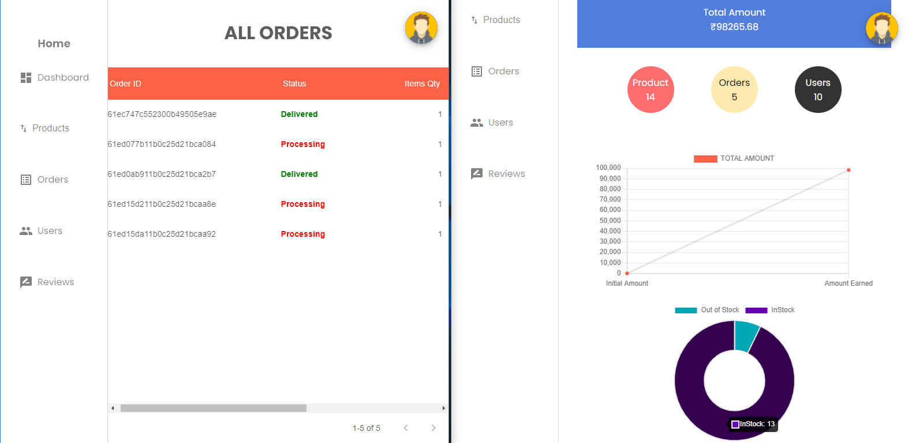

# Full Stack MERN E-commerce Web Application -

## Tech Stack used -

- FrontEnd - ReactJs
- React Redux for entire application state management.
- Styling - Pure Vanilla CSS & MUI Icons

## Backend -

NodeJs + ExpressJs + Mongoose

**[Repository](https://github.com/adidoshi/e-commerce-app_backend) | [Postman Doc](https://documenter.getpostman.com/view/15329989/UVJfjFEx)**

---

## Core Functionalities -

### Authentication

- Complete user authentication with JWT token, protected routes for users.
- Register and login forms handled by formik and yup library which helps in keeping track of values/errors/visited fields, validation, and handling submission in a smooth way.
- Forgot Password & reset password -> an email is being sent to the user with reset pass link & onclick user is redirected to reset pass page.

### Routing -

1. User is restricted to visit protected routes if not logged in. If anyone tries to access protected routes it's redirected to login page.
1. Admin routes are only accessible for user with admin role.

### Public Routes -

1. Landing page & products listing, filter products based on category, price, ratings.
1. Products details page -> responsive-carousel to view product images -> a review section wherin user can submit a review for each product along with rating (out of 5 stars). Review can be edited by the user.
1. Add to cart feature, whenever user clicks on add to cart -> item is being stored in local storage. Also real time value on the cart symbol badge is updated. User can click there to visit cart page.

### User routes -

1. User profile page -> user can edit profile details like name, email & update a avatar (profile img) which gets uploaded to cloudinary.
1. User can update password -> old password is validated for this request.
1. User options are available in the speed dial icon list where user can access their cart, orders, profile, logout.

### Checkout process -

- From cart page user is redirected to shipping page wherein user needs to fill shipping details and after submit it gets stored in local storage.
- After that confirm order page -> where all items details, amount, address is visibile to check once by the user. Order details are being saved in _session storage_ so that when close the tab or browser it gets deleted.
- Finally user is redirected to payment page. Mock (test mode) payment method achieved by **STRIPE** & **RAZORPAY** payment gateway.
- Order success page.

### Admin Dashboard -

1. Overall sales figures and products stock & out of stock represented with the help of react-chart-js-2 library in the form of **Line** & **Doughnut** charts.
1. Admin can create a new product (name, description, price, stock, category) also adding images which gets uploaded to cloudinary. _Also product can be edited or deleted_. Real time data get's reflected on the web app i.e. product get's listed which can be visible to users.
1. Admin can update the order status from processing -> shipping -> delivered which gets reflected on user order details page. Once the order is shipped stock quantity get's reduced from the database. Order can be deleted on admin end.
1. Admin is able to view the list of all users registered on splash store web app, so that user role can be updated between user / admin. Also user details can be updated or user can be deleted.
1. Admin can delete a review for a product.

---

### Made with ❤️

by [adidoshi](https://github.com/adidoshi)
